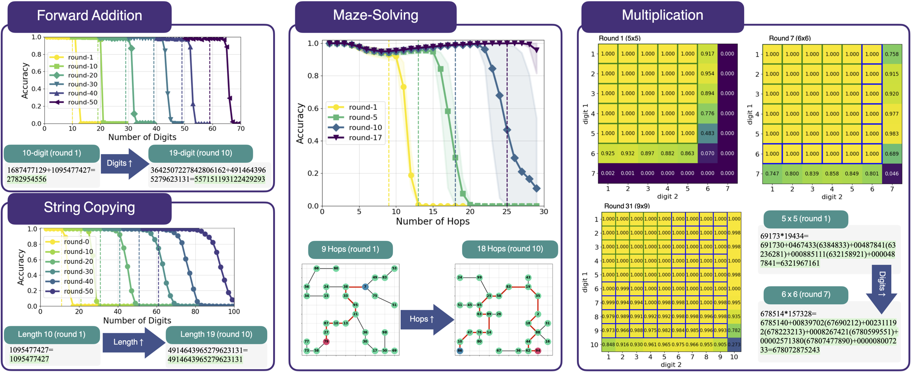

# Self-Improving Transformers Overcome Easy-to-Hard and Length Generalization Challenges

This repository contains the code for the paper "Self-Improving Transformers Overcome Easy-to-Hard and Length Generalization Challenges".

<div align="center">
  
  <p><em>Overview of self-improvement results. Models trained with self-improvement can tackle increasingly complex tasks that extend far beyond their initial training distributions, achieving significant generalization without any additional supervision.</em></p>
</div>

## Dependencies

<!-- Before running the experiments, ensure you have zsh installed:
```bash
sudo apt-get install zsh
``` -->

Assuming you have CUDA 12 and python 3.11.

To install the required dependencies, run:
```bash
pip install torch==2.4.0 numpy==1.26.4
pip install transformers==4.48.0 accelerate==1.2.1 datasets==3.2.0 trl==0.10.1 peft==0.12.0 Levenshtein==0.25.1 sentencepiece==0.2.0 wandb==0.17.0
pip install wheel
pip install flash-attn==2.7.4.post1 --no-build-isolation
```
When installing flash attention, you may run into the following issues
- `RuntimeError: FlashAttention is only supported on CUDA 11.7 and above.` --> Make sure CUDA_HOME is set to the correct path. e.g. `export CUDA_HOME=/usr/local/cuda-12.2`
- `undefined symbol: _ZNK3c1011StorageImpl27throw_data_ptr_access_errorEv` --> make sure you are using python 3.11 instead of 3.12

## Experiments

### Reverse Addition (Section 4.1)
```bash
zsh experiments/run_addition_new.sh
zsh experiments/run_addition_new_eval.sh # Eval only
```

### String copy & Reverse (Section 4.2)
```bash
zsh experiments/run_copy_new.sh
zsh experiments/run_copy_new_eval.sh # Eval only
zsh experiments/run_reverse_new.sh
zsh experiments/run_reverse_new_eval.sh # Eval only
```

### Forward Addition (Section 6.1)
```bash
zsh run_forward_length_filter.sh
```

### Multiplication (Section 6.2)
```bash
zsh experiments/run_multiplication_mv_len.sh
```

### Mazes (Section 6.3)
```bash
zsh experiments/run_maze_hops_vanilla.sh
zsh experiments/run_maze_nodes_vanilla.sh
```

### Ablation: Accelerated Self-Improvement (Section 7.2)
```bash
zsh experiments/run_copy_fast_new.sh
zsh experiments/run_mult_fast.sh
```

### Ablation: Pretrained Models (Section 7.3)
```bash
zsh experiments/run_addition_pretrained_1B_new.sh
zsh experiments/run_addition_pretrained_3B_new.sh
zsh experiments/run_addition_pretrained_1B_fast_new.sh
zsh experiments/run_addition_pretrained_3B_fast_new.sh
```

### Error Analysis on Reverse Addition (Section 8.2)
```bash
zsh experiments/run_addition_sweep_random_labels_new.sh
```

The plotting functions are in `plotting/reverse_add_error_analysis.ipynb` and `plotting/self_improve.ipynb`.
